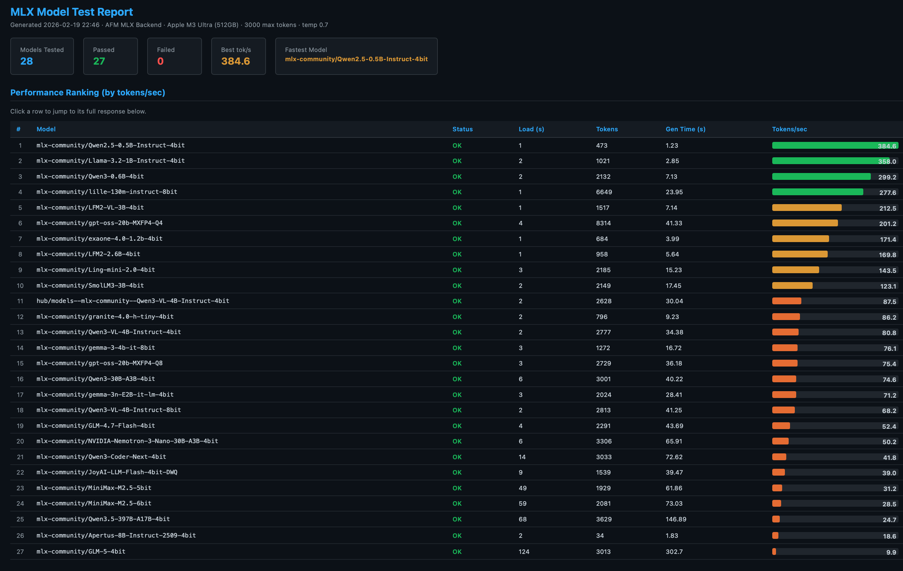

If you find this useful, please ⭐ the repo! &nbsp; Also check out [Vesta AI Explorer](https://kruks.ai/) — my full-featured native macOS AI app.

# afm — Run Any LLM on Your Mac, 100% Local

Run open-source MLX models **or** Apple's on-device Foundation Model through an OpenAI-compatible API. Built entirely in Swift for maximum Metal GPU performance. No Python runtime, no cloud, no API keys.

## Install

|  | Stable (v0.9.4) | Nightly (afm-next) |
|---|---|---|
| **Homebrew** | `brew install scouzi1966/afm/afm` | `brew install scouzi1966/afm/afm-next` |
| **pip** | `pip install macafm` | — |
| **Release notes** | [v0.9.4](https://github.com/scouzi1966/maclocal-api/releases/tag/v0.9.4) | [Latest nightly](https://github.com/scouzi1966/maclocal-api/releases) |

> [!TIP]
> **Switching between stable and nightly:**
> ```bash
> brew unlink afm && brew install scouzi1966/afm/afm-next   # switch to nightly
> brew unlink afm-next && brew link afm                      # switch back to stable
> ASSUMES you did a brew install scouzi1966/afm/afm previously
> ```

### [afm-next Nightly Test Report — Qwen3.5-35B-A3B Focus](https://kruks.ai/macafm/)

## What's new in afm-next

> [!IMPORTANT]
> The nightly build is the future stable release. It includes everything in v0.9.4 plus:
> - the test-reports folder is a mess but contains the extensive test reports performed
> - **Qwen3.5-35B-A3B MoE** — run a 35B model with only 3B active parameters (--vlm for image,video)
> - **Full tool calling** — Qwen3-Coder, Gemma, GLM, Kimi-K2.5, and more
> - **Prompt prefix caching** for faster repeat inference
> - **Stop sequences** with `<think>` model support
> - **New architectures** — Qwen3.5, Gemma 3n, Kimi-K2.5, MiniMax M2.5, Nemotron
> - --guided-json for structured output
> - Stop sequences through API
> - Pass image objects to API (using OpenAI APi SDK standards)
> - logprobs for agentic interpretability testing
> - top-k, min-p and presence penalty parameters
> - --tool-call-parser (experimental) hermes, llama3_json, gemma, mistral, qwen3_xml
> - Many more! afm mlx -h (not all features are wired at the moment)

## Quick Start

```bash
# Run any MLX model with WebUI
afm mlx -m mlx-community/Qwen3.5-35B-A3B-4bit -w

# Or any smaller model
afm mlx -m mlx-community/gemma-3-4b-it-8bit -w

# Chat from the terminal (auto-downloads from Hugging Face)
afm mlx -m Qwen3-0.6B-4bit -s "Explain quantum computing"

# Interactive model picker (lists your downloaded models)
MACAFM_MLX_MODEL_CACHE=/path/to/models afm mlx -w

# Apple's on-device Foundation Model with WebUI
afm -w
```

## Use with OpenCode

[OpenCode](https://opencode.ai/) is a terminal-based AI coding assistant. Connect it to afm for a fully local coding experience — no cloud, no API keys. No Internet required (other than initially download the model of course!)

**1. Configure OpenCode** (`~/.config/opencode/opencode.json`):

```json
{
  "$schema": "https://opencode.ai/config.json",
  "provider": {
    "ollama": {
      "npm": "@ai-sdk/openai-compatible",
      "name": "macafm (local)",
      "options": {
        "baseURL": "http://localhost:9999/v1"
      },
      "models": {
        "mlx-community/Qwen3-Coder-Next-4bit": {
          "name": "mlx-community/Qwen3-Coder-Next-4bit"
        }
      }
    }
  }
}
```

**2. Start afm with a coding model:**
```bash
afm mlx -m mlx-community/Qwen3-Coder-Next-4bit -t 1.0 --top-p 0.95 --max-tokens 8192
```

**3. Launch OpenCode** and type `/connect`. Scroll down to the very bottom of the provider list — `macafm (local)` will likely be the last entry. Select it, and when prompted for an API key, enter any value (e.g. `x`) — tokenized access is not yet implemented in afm so the key is ignored. All inference runs locally on your Mac's GPU.

---

## 28+ MLX Models Tested



28 models tested and verified including Qwen3, Gemma 3/3n, GLM-4/5, DeepSeek V3, LFM2, SmolLM3, Llama 3.2, MiniMax M2.5, Nemotron, and more. See [test reports](test-reports/).

---

[](https://swift.org)
[](https://developer.apple.com/macos/)
[](LICENSE)

## ⭐ Star History

[](https://star-history.com/#scouzi1966/maclocal-api&Date)

## Related Projects

- [Vesta AI Explorer](https://kruks.ai/) — full-featured native macOS AI chat app
- [AFMTrainer](https://github.com/scouzi1966/AFMTrainer) — LoRA fine-tuning wrapper for Apple's toolkit (Mac M-series & Linux CUDA)
- [Apple Foundation Model Adapters](https://developer.apple.com/apple-intelligence/foundation-models-adapter/) — Apple's adapter training toolkit

## 🌟 Features

- **🔗 OpenAI API Compatible** - Works with existing OpenAI client libraries and applications
- **🧠 MLX Local Models** - Run any Hugging Face MLX model locally (Qwen, Gemma, Llama, DeepSeek, GLM, and 28+ tested models)
- **🌐 API Gateway** - Auto-discovers and proxies Ollama, LM Studio, Jan, and other local backends into a single API
- **⚡ LoRA adapter support** - Supports fine-tuning with LoRA adapters using Apple's tuning Toolkit
- **📱 Apple Foundation Models** - Uses Apple's on-device 3B parameter language model
- **👁️ Vision OCR** - Extract text from images and PDFs using Apple Vision (`afm vision`)
- **🖥️ Built-in WebUI** - Chat interface with model selection (`afm -w`)
- **🔒 Privacy-First** - All processing happens locally on your device
- **⚡ Fast & Lightweight** - No network calls, no API keys required
- **🛠️ Easy Integration** - Drop-in replacement for OpenAI API endpoints
- **📊 Token Usage Tracking** - Provides accurate token consumption metrics

## 📋 Requirements

- **macOS 26 (Tahoe) or later
- **Apple Silicon Mac** (M1/M2/M3/M4 series)
- **Apple Intelligence enabled** in System Settings
- **Xcode 26 (for building from source)

## 🚀 Quick Start

### Installation

#### Option 1: Homebrew (Recommended)

```bash
# Add the tap
brew tap scouzi1966/afm

# Install AFM
brew install afm

# Verify installation
afm --version
```
#### Option 2: pip (PyPI)

```bash
# Install from PyPI
pip install macafm

# Verify installation
afm --version
```

#### Option 3: Build from Source

```bash
# Clone the repository with submodules
git clone --recurse-submodules https://github.com/scouzi1966/maclocal-api.git
cd maclocal-api

# Build everything from scratch (patches + webui + release build)
./Scripts/build-from-scratch.sh

# Or skip webui if you don't have Node.js
./Scripts/build-from-scratch.sh --skip-webui

# Or use make (patches + release build, no webui)
make

# Run
./.build/release/afm --version
```

### Running

```bash
# API server only (Apple Foundation Model on port 9999)
afm

# API server with WebUI chat interface
afm -w

# WebUI + API gateway (auto-discovers Ollama, LM Studio, Jan, etc.)
afm -w -g

# Custom port with verbose logging
afm -p 8080 -v

# Show help
afm -h
```

### MLX Local Models

Run open-source models locally on Apple Silicon using MLX:

```bash
# Run a model with single prompt
afm mlx -m mlx-community/Qwen2.5-0.5B-Instruct-4bit -s "Explain gravity"

# Start MLX model with WebUI
afm mlx -m mlx-community/gemma-3-4b-it-8bit -w

# Interactive model picker (lists downloaded models)
afm mlx -w

# MLX model as API server
afm mlx -m mlx-community/Llama-3.2-1B-Instruct-4bit -p 8080

# Pipe mode
cat essay.txt | afm mlx -m mlx-community/Qwen3-0.6B-4bit -i "Summarize this"

# MLX help
afm mlx --help
```

Models are downloaded from Hugging Face on first use and cached locally. Any model from the [mlx-community](https://huggingface.co/mlx-community) collection is supported.

## 📡 API Endpoints

### Chat Completions
**POST** `/v1/chat/completions`

Compatible with OpenAI's chat completions API.

```bash
curl -X POST http://localhost:9999/v1/chat/completions \
  -H "Content-Type: application/json" \
  -d '{
    "model": "foundation",
    "messages": [
      {"role": "user", "content": "Hello, how are you?"}
    ]
  }'
```

### List Models
**GET** `/v1/models`

Returns available Foundation Models.

```bash
curl http://localhost:9999/v1/models
```

### Health Check
**GET** `/health`

Server health status endpoint.

```bash
curl http://localhost:9999/health
```

## 💻 Usage Examples

### Python with OpenAI Library

```python
from openai import OpenAI

# Point to your local MacLocalAPI server
client = OpenAI(
    api_key="not-needed-for-local",
    base_url="http://localhost:9999/v1"
)

response = client.chat.completions.create(
    model="foundation",
    messages=[
        {"role": "user", "content": "Explain quantum computing in simple terms"}
    ]
)

print(response.choices[0].message.content)
```

### JavaScript/Node.js

```javascript
import OpenAI from 'openai';

const openai = new OpenAI({
  apiKey: 'not-needed-for-local',
  baseURL: 'http://localhost:9999/v1',
});

const completion = await openai.chat.completions.create({
  messages: [{ role: 'user', content: 'Write a haiku about programming' }],
  model: 'foundation',
});

console.log(completion.choices[0].message.content);
```

### curl Examples

```bash
# Basic chat completion
curl -X POST http://localhost:9999/v1/chat/completions \
  -H "Content-Type: application/json" \
  -d '{
    "model": "foundation",
    "messages": [
      {"role": "system", "content": "You are a helpful assistant."},
      {"role": "user", "content": "What is the capital of France?"}
    ]
  }'

# With temperature control
curl -X POST http://localhost:9999/v1/chat/completions \
  -H "Content-Type: application/json" \
  -d '{
    "model": "foundation",
    "messages": [{"role": "user", "content": "Be creative!"}],
    "temperature": 0.8
  }'
```

### Single Prompt & Pipe Examples

```bash
# Single prompt mode
afm -s "Explain quantum computing"

# Piped input from other commands
echo "What is the meaning of life?" | afm
cat file.txt | afm
git log --oneline | head -5 | afm

# Custom instructions with pipe
echo "Review this code" | afm -i "You are a senior software engineer"
```

## 🏗️ Architecture

```
MacLocalAPI/
├── Package.swift                    # Swift Package Manager config
├── Sources/MacLocalAPI/
│   ├── main.swift                   # CLI entry point & ArgumentParser
│   ├── Server.swift                 # Vapor web server configuration
│   ├── Controllers/
│   │   └── ChatCompletionsController.swift  # OpenAI API endpoints
│   └── Models/
│       ├── FoundationModelService.swift     # Apple Foundation Models wrapper
│       ├── OpenAIRequest.swift              # Request data models
│       └── OpenAIResponse.swift             # Response data models
└── README.md
```

## 🔧 Configuration

### Command Line Options

```
OVERVIEW: macOS server that exposes Apple's Foundation Models through
OpenAI-compatible API

Use -w to enable the WebUI, -g to enable API gateway mode (auto-discovers and
proxies to Ollama, LM Studio, Jan, and other local LLM backends).

USAGE: afm <options>
       afm mlx [<options>]      Run local MLX models from Hugging Face
       afm vision <image>       OCR text extraction from images/PDFs

OPTIONS:
  -s, --single-prompt <single-prompt>
                          Run a single prompt without starting the server
  -i, --instructions <instructions>
                          Custom instructions for the AI assistant (default:
                          You are a helpful assistant)
  -v, --verbose           Enable verbose logging
  --no-streaming          Disable streaming responses (streaming is enabled by
                          default)
  -a, --adapter <adapter> Path to a .fmadapter file for LoRA adapter fine-tuning
  -p, --port <port>       Port to run the server on (default: 9999)
  -H, --hostname <hostname>
                          Hostname to bind server to (default: 127.0.0.1)
  -t, --temperature <temperature>
                          Temperature for response generation (0.0-1.0)
  -r, --randomness <randomness>
                          Sampling mode: 'greedy', 'random',
                          'random:top-p=<0.0-1.0>', 'random:top-k=<int>', with
                          optional ':seed=<int>'
  -P, --permissive-guardrails
                          Permissive guardrails for unsafe or inappropriate
                          responses
  -w, --webui             Enable webui and open in default browser
  -g, --gateway           Enable API gateway mode: discover and proxy to local
                          LLM backends (Ollama, LM Studio, Jan, etc.)
  --prewarm <prewarm>     Pre-warm the model on server startup for faster first
                          response (y/n, default: y)
  --version               Show the version.
  -h, --help              Show help information.

Note: afm also accepts piped input from other commands, equivalent to using -s
with the piped content as the prompt.
```

### Environment Variables

The server respects standard logging environment variables:
- `LOG_LEVEL` - Set logging level (trace, debug, info, notice, warning, error, critical)

## ⚠️ Limitations & Notes

- **Model Scope**: Apple Foundation Model is a 3B parameter model (optimized for on-device performance)
- **macOS 26+ Only**: Requires the latest macOS with Foundation Models framework
- **Apple Intelligence Required**: Must be enabled in System Settings
- **Token Estimation**: Uses word-based approximation for token counting (Foundation model only; proxied backends report real counts)

## 🔍 Troubleshooting

### "Foundation Models framework is not available"
1. Ensure you're running **macOS 26 or later
2. Enable **Apple Intelligence** in System Settings → Apple Intelligence & Siri
3. Verify you're on an **Apple Silicon Mac**
4. Restart the application after enabling Apple Intelligence

### Server Won't Start
1. Check if the port is already in use: `lsof -i :9999`
2. Try a different port: `afm -p 8080`
3. Enable verbose logging: `afm -v`

### Build Issues
1. Ensure you have **Xcode 26 installed
2. Update Swift toolchain: `xcode-select --install`
3. Clean and rebuild: `swift package clean && swift build -c release`

## 🤝 Contributing

Contributions are welcome! Please feel free to submit a Pull Request. For major changes, please open an issue first to discuss what you would like to change.

### Development Setup

```bash
# Clone the repo with submodules
git clone --recurse-submodules https://github.com/scouzi1966/maclocal-api.git
cd maclocal-api

# Full build from scratch (submodules + patches + webui + release)
./Scripts/build-from-scratch.sh

# Or for debug builds during development
./Scripts/build-from-scratch.sh --debug --skip-webui

# Run with verbose logging
./.build/debug/afm -w -g -v
```

## 📄 License

This project is licensed under the MIT License - see the [LICENSE](LICENSE) file for details.

## 🙏 Acknowledgments

- Apple for the Foundation Models framework
- The Vapor Swift web framework team
- OpenAI for the API specification standard
- The Swift community for excellent tooling

## 📞 Support

If you encounter any issues or have questions:

1. Check the [Troubleshooting](#-troubleshooting) section
2. Search existing [GitHub Issues](https://github.com/scouzi1966/maclocal-api/issues)
3. Create a new issue with detailed information about your problem

## 🗺️ Roadmap

- [x] Streaming response support
- [x] MLX local model support (28+ models tested)
- [x] Multiple model support (API gateway mode)
- [x] Web UI for testing (llama.cpp WebUI integration)
- [x] Vision OCR subcommand
- [x] Function/tool calling (OpenAI-compatible, multiple formats)
- [ ] Performance optimizations
- [ ] Docker containerization (when supported)

---

**Made with ❤️ for the Apple Silicon community**

*Bringing the power of local AI to your fingertips.*
