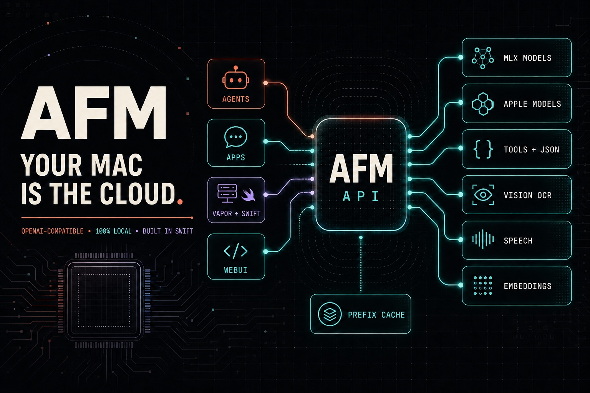
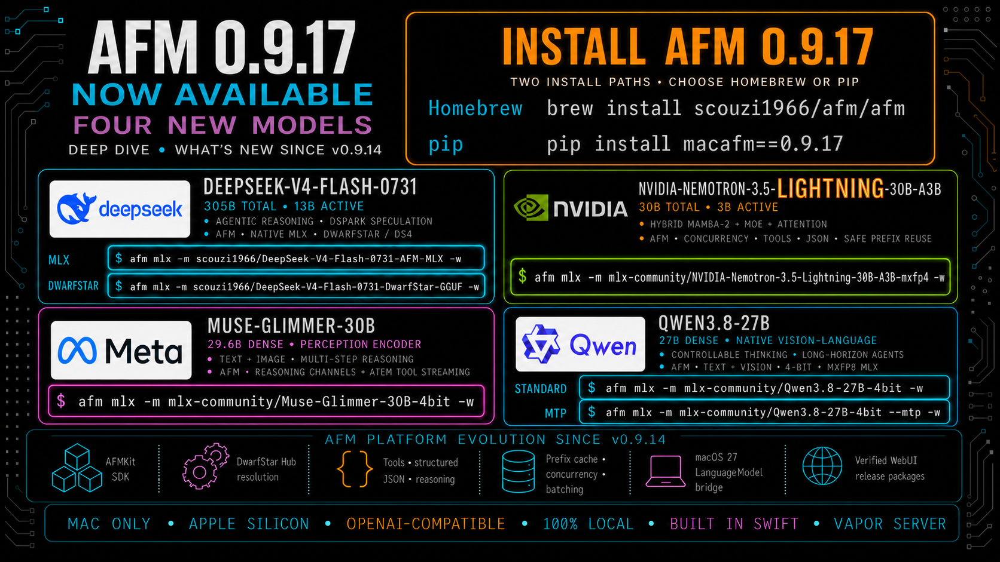

# AFM — local AI infrastructure for Apple Silicon

[](https://swift.org)
[](https://developer.apple.com/macos/)
[](#api-surface)
[](LICENSE)

[Website](https://maclocal.ai) · [Documentation](https://maclocal.ai/docs) · [GitHub releases](https://github.com/scouzi1966/maclocal-api/releases)

> [!IMPORTANT]
> **AFM is moving to a two-layer architecture built on AFMKit.**
>
> [AFMKit](https://github.com/scouzi1966/AFMKit) is the reusable Swift foundation
> for building native AI apps and agents on Apple platforms. It owns the shared
> model contracts and provider runtimes for Apple Foundation Models, MLX, and
> DwarfStar, including generation, streaming, tool calling, structured output,
> and multimodal services.
>
> **maclocal-api remains the complete AFM product**: the `afm` CLI, local
> OpenAI-compatible server, WebUI, packaging, and operational tooling. It now
> consumes one exact-versioned AFMKit dependency instead of carrying parallel
> provider implementations. This separation lets apps and agents embed AFMKit
> directly while server users continue to install and run AFM as before.
>
> The migration is being delivered incrementally. Existing AFM commands and API
> compatibility remain the product contract while provider ownership moves into
> AFMKit and maclocal-api becomes a focused application layer on top of it.

## What's new

### [AFM v0.9.17](https://github.com/scouzi1966/maclocal-api/releases/tag/v0.9.17)

[](https://github.com/scouzi1966/maclocal-api/releases/tag/v0.9.17)

AFM turns an Apple Silicon Mac into a private, OpenAI-compatible AI server. Run Hugging Face MLX models or Apple’s on-device Foundation Model, then connect the clients and SDKs you already use.

- Native Swift executable—no Python runtime for serving
- Local inference—no cloud account or API key
- Chat, streaming, tools, structured output, reasoning, and logprobs
- Vision OCR, speech, embeddings, and a built-in WebUI
- Prefix caching, concurrent decode, speculative decoding, and metrics
- Importable Swift packages for apps that need in-process inference

> AFM is for Apple Silicon Macs running current macOS/Xcode toolchains. MLX model weights download from Hugging Face the first time you use them.

## Install

> [!NOTE]
> **Stable v0.9.17 is the recommended release.** It adds automatic Qwen 3.8 MTP sidecar discovery and quant-matched download behavior, plus expanded Qwen 3.8 tool-calling qualification. Install `afm-next` only to preview changes made after v0.9.17.
>
> **The qualified nightly and v0.9.17 are essentially the same build.** Nightly `nightly-20260816-bc343f6` was promoted to this stable release; the differences are release versioning and distribution packaging, not runtime functionality. Use the stable release unless a newer nightly explicitly lists post-v0.9.17 changes you need.

|  | Stable (v0.9.17) | Nightly (afm-next) |
|---|---|---|
| **Homebrew** | `brew install scouzi1966/afm/afm` | `brew install scouzi1966/afm/afm-next` |
| **pip** | `pip install macafm` | `pip install --extra-index-url https://maclocal-ai.pages.dev/afm/wheels/simple/ macafm-next` |
| **Release notes** | [v0.9.17](https://github.com/scouzi1966/maclocal-api/releases/tag/v0.9.17) | [Latest nightly](https://github.com/scouzi1966/maclocal-api/releases) |

### Install a previous version

Older stable releases are kept as pinned formulae in the Homebrew tap and as version-pinned wheels on PyPI. This is useful for reproducing an issue against a specific build or rolling back without waiting for a new release.

**Homebrew (pinned stable formulae):** `afm@<version>` — available for `0.9.0`, `0.9.1`, and `0.9.3`–`0.9.10`.

```bash
brew install scouzi1966/afm/afm@0.9.10
brew uninstall afm
brew link afm@0.9.10
afm --version
```

**Homebrew (pinned nightly formulae):** `afm-next@<full-version>` — for example, `afm-next@0.9.15-next.20260808.e70cc52`. See the [Homebrew tap](https://github.com/scouzi1966/homebrew-afm) for available pinned nightlies.

```bash
brew install scouzi1966/afm/afm-next@0.9.15-next.20260808.e70cc52
```

**pip (version-pinned wheels):** install any published release by version.

```bash
pip install macafm==0.9.10
pip install --extra-index-url https://maclocal-ai.pages.dev/afm/wheels/simple/ \
  macafm-next==0.9.15.dev20260808
```

## Start in two minutes

```bash
brew install scouzi1966/afm/afm

# Start a small MLX model and open the WebUI
afm mlx -m Qwen3-0.6B-4bit -w
```

AFM is now listening at `http://127.0.0.1:9999/v1`.

```bash
curl http://127.0.0.1:9999/v1/chat/completions \
  -H 'Content-Type: application/json' \
  -d '{
    "model": "Qwen3-0.6B-4bit",
    "messages": [{"role": "user", "content": "Explain unified memory in one paragraph."}],
    "stream": false
  }'
```

Or use Apple’s on-device model:

```bash
afm -w
```

### Native terminal chat

Use `--tui` when you want a private, full-screen chat without running an HTTP server:

```bash
# Apple Foundation Models
afm --tui

# Any supported MLX model (all normal sampling/runtime flags still apply)
afm mlx -m Qwen3-0.6B-4bit --tui
```

TUI changes have a model-free regression harness. `make test-tui` runs stable
Markdown/math/code snapshots and exercises keyboard input, terminal sizing,
alternate-screen cleanup, and raw-mode restoration through a real macOS
pseudo-terminal. If an intentional visual change updates the expected output,
run `Scripts/test-tui.sh --record`, inspect the snapshot diff, then rerun
`make test-tui` normally. The same focused suite runs automatically on relevant
pull requests.

The terminal UI streams responses, separates optional reasoning, and renders both answers
and visible reasoning through a native CommonMark/GFM renderer. Headings, nested/task lists,
quotes, tables, links, inline formatting, fenced code, and raw HTML are presented as inert
terminal output. Code uses source-compiled Tree-sitter grammars for semantic highlighting
and line numbers ([details](docs/tui-syntax-highlighting.md)); unified diffs
have distinct file, hunk, addition, and deletion styling. Inline and display LaTeX are rendered
as readable Unicode math, including fractions, roots, super/subscripts, operators, Greek
symbols, matrices, and cases. The UI also reports token and throughput statistics.

Reasoning is collapsed by default into a live activity row with its phase, animated cursor,
elapsed time, and generated character count. Press `Tab` during generation to expand or
collapse the reasoning panel without interrupting the model. Use `/reasoning expanded`,
`/reasoning collapsed`, `/reasoning off`, or `/reasoning last` to control it explicitly.

It supports multiline editing, prompt history, cancellation, persisted/searchable sessions
under `~/.afm/sessions`, transcript export, attachments, terminal-width-aware tables, themes,
and safe actions for response artifacts. Use `/help` for the command palette.

The navigation follows Codex CLI conventions. Normal chat output remains in Terminal
scrollback. Press `Ctrl+T` to open the full transcript overlay, then scroll with a Mac
trackpad or mouse wheel, arrows, Page Up/Down, Ctrl-U/Ctrl-D, or Home/End; press `Ctrl+T`
again to close it. Add `--no-alt-screen` to keep overlays inline too. `/blocks` opens a
session-wide code-block list: navigate with arrows or paging keys, press Enter for
Copy/Save/Preview actions, and Escape to return. Numbered `/save`, `/copy`, and `/open`
commands remain available for direct use.

Code is never executed automatically. `/save` refuses overwrites unless `/save!` is used,
and only an explicit `/open` previews HTML or JavaScript in the browser. iTerm2 and Kitty
can display local images inline; Terminal.app uses an explicit `/image` Quick Look fallback.

## Choose your runtime

| Runtime | Best for | Start it |
|---|---|---|
| **MLX** | Open models, VLMs, agent controls, performance tuning | `afm mlx -m <model>` |
| **Apple Foundation Models** | Zero-download system model and `.fmadapter` LoRA adapters | `afm` |
| **DwarfStar** | Compatible fixed-schedule Metal checkpoints | `afm mlx -m <owner/repo>` (auto-resolved) or `afm mlx -m <checkpoint.gguf> --mlx-runtime dwarfstar` |
| **Gateway** | One model list for Ollama, LM Studio, Jan, and other local servers | `afm --gateway` |

Model IDs without an organization default to `mlx-community`, so `Qwen3-0.6B-4bit` and `mlx-community/Qwen3-0.6B-4bit` both work.

## Evaluate a local model

AFM ships all 91 labeled variants from the repository's comprehensive MLX test as a
deterministic, no-judge suite. The model loads once, every output and timing measurement is
retained locally, and a self-contained HTML report opens when the run finishes.

```bash
afm mlx -m mlx-community/Qwen3-0.6B-4bit --eval

# Headless run, suite discovery, and custom-suite scaffolding
afm mlx -m <model> --eval --no-open
afm mlx --eval-list
afm mlx --eval-init my-suite
afm mlx --eval-validate ~/.afm/evals/my-suite.json
afm mlx -m <model> --eval-suite comprehensive --eval-suite my-suite
```

Run artifacts are stored in collision-safe
`~/.afm/evals/<date-time>-<model>-<suite>/` directories. See
[Local model evaluations](docs/model-evaluations.md) for the suite schema, deterministic
checks, report contents, and security limits.

## Why AFM works well for agents

AFM is built for multi-turn, tool-using clients—not only chat demos.

| Capability | What it gives you |
|---|---|
| Native tool formats | Auto-detection for JSON, Qwen XML, Gemma, GLM, Kimi, MiniMax, LFM2, and related formats |
| Tool choice | `auto`, `none`, `required`, and named-function forcing |
| Streaming tool deltas | OpenAI-style tool-call chunks while ordinary content continues to stream |
| Structured output | `json_object`, `json_schema`, and token-level xgrammar enforcement when enabled |
| Reasoning extraction | `<think>` and harmony analysis channels mapped to `reasoning_content` |
| Determinism and inspection | `seed`, `logprobs`, `top_logprobs`, request IDs, tracing, and raw-parser mode |
| Long-running reliability | Cancellation, `Retry-After`, token counting, fair concurrent queues, and Prometheus metrics |
| Prefix reuse | Radix-tree KV caching for stable system prompts and multi-turn agent loops |

### Pick a tool-calling mode

- **Native (default):** AFM detects the model’s own format and uses the narrowest parser. Use this for parity checks and benchmarks.
- **Repair:** add `--tool-call-parser afm_adaptive_xml` for JSON-in-XML fallback, type coercion, nullable-schema handling, and fuzzy tool-name matching. Add `--fix-tool-args` when a model renames arguments.
- **Raw:** add `--tool-call-parser none` to return the model’s tool markup as ordinary assistant content.

See [MLX tool-calling modes](docs/mlx-tool-calling.md) for examples and benchmark guidance.

## Connect an existing client

Most OpenAI-compatible clients need only a base URL and a placeholder API key:

```text
Base URL: http://127.0.0.1:9999/v1
API key:  x
```

Copy-ready guides:

[OpenCode](docs/clients/opencode.md) · [OpenClaw](docs/clients/openclaw.md) · [Cline](docs/clients/cline.md) · [Continue](docs/clients/continue.md) · [Aider](docs/clients/aider.md) · [Cursor](docs/clients/cursor.md) · [Hermes](docs/clients/hermes.md)

OpenClaw users can also generate a provider block directly:

```bash
afm mlx -m Qwen3-Coder-Next-4bit --openclaw-config
```

## API surface

| Method | Endpoint | Purpose |
|---|---|---|
| `POST` | `/v1/chat/completions` | Chat, SSE streaming, tools, reasoning, structured output, logprobs |
| `GET` | `/v1/models` | Active model and gateway model discovery |
| `POST` | `/v1/embeddings` | Apple NaturalLanguage embeddings for RAG and semantic search |
| `POST` | `/v1/vision/ocr` | OCR, tables, barcodes, classification, saliency, and PDFs |
| `POST` | `/v1/audio/transcriptions` | On-device speech-to-text |
| `POST` | `/v1/audio/speech` | Text-to-speech using installed Apple voices |
| `POST` | `/v1/tokenize` | vLLM-compatible tokens and counts for the loaded MLX model |
| `POST` | `/v1/count_tokens` | Anthropic-style input token count |
| `POST` | `/v1/batch/completions` | Multiplex up to 64 completions over SSE |
| `POST` | `/v1/chat/completions/{id}/cancel` | Cancel an in-flight generation |
| `GET` | `/metrics` | Prometheus queue, token, throughput, and timing metrics |
| `GET` | `/openapi.json` | OpenAPI description |
| `GET` | `/docs` | Interactive API reference served by AFM |

AFM also implements OpenAI-style file and batch-job endpoints under `/v1/files` and `/v1/batches` when the MLX batch service is active.

## Apple-native tools

The CLI and HTTP server expose useful system frameworks without another service.

```bash
# OCR text or a table from an image/PDF
afm vision --file invoice.pdf --table

# Other Vision modes: text, table, barcode, classify, saliency, auto
afm vision --file photo.heic --mode classify --format json

# Speech recognition
afm speech transcribe --file meeting.wav --format srt

# Text to speech
afm speech synthesize "Hello from AFM" --voice nova --output hello.aac

# Dedicated OpenAI-compatible embeddings server (default port 9998)
afm embed
```

For vision-language models, add `--vlm` and pass one or more files with `--media`.

## Performance controls

Defaults are a good starting point. Use these when the workload calls for them:

```bash
# Reuse prompt KV across requests
afm mlx -m <model> --enable-prefix-caching

# Save memory on long context
afm mlx -m <model> --kv-bits 8

# Fair-queue concurrent requests through one model
afm mlx -m <model> --concurrent 4

# Strict tool/JSON schemas with xgrammar
afm mlx -m <model> --enable-grammar-constraints

# Per-request device, memory, timing, and bandwidth estimates
afm mlx -m <model> --gpu-profile -s "Explain Metal kernels"
```

Supported checkpoints can also use speculative decoding:

- `--mtp` for compatible Qwen models. Qwen3.8 automatically prefetches the
  separately published MTP head matching the base checkpoint's quantization;
  use `--mtp-model <repo-or-path>` to override it.
- `--eagle3 <drafter-directory>` for supported dense Gemma4 models
- `--dspark-support <support.gguf>` for compatible DwarfStar DSpark workflows

Read [decode optimizations](docs/decode-optimizations.md) before choosing a checkpoint or interpreting benchmark results.

## Sampling and response controls

The MLX backend supports `temperature`, `top_p`, `top_k`, `min_p`, `repetition_penalty`, `presence_penalty`, `seed`, `stop`, `logprobs`, and `top_logprobs`.

Useful server defaults:

```bash
# Apply one JSON schema when requests omit response_format
afm mlx -m <model> \
  --guided-json '{"type":"object","properties":{"answer":{"type":"string"}},"required":["answer"]}' \
  --enable-grammar-constraints

# Disable model reasoning/thinking
afm mlx -m <model> --no-thinking

# Pin chat-template keyword arguments
afm mlx -m <model> --chat-template-kwargs '{"enable_thinking":false}'
```

## Use AFMKit and AFM as Swift packages

The independent `scouzi1966/AFMKit` package defines the provider products:

- `AFMKitCore` — provider contracts and core types
- `AFMOpenAICompat` — OpenAI-compatible request/response types
- `AFMKitMLX` — MLX model loading and inference
- `AFMKitApple` — Apple Foundation Models backend
- `AFMKitFoundationModelsMLX` — macOS 27 MLX executor bridge
- `AFMKitDwarfStar` — DwarfStar runtime integration

This maclocal-api consumer package separately defines its application adapters:

- `AFMKitFoundationModels` — compatibility re-export of `AFMKitApple`
- `AFMKitFoundationModels27` — macOS 27 application adapters
- `AFMKitFoundationModels27DwarfStar` — opt-in DwarfStar macOS 27 adapter
- `AFMKitServices` — vision, speech, and embedding services
- `AFMKit` — high-level headless inference facade
- `AFMServer` — Vapor HTTP layer
- `afm` — CLI executable

AFMKit is revision-pinned while its API is under development. That checkpoint
is valid for authenticated development, but it is not a versioned SwiftPM
publication contract even if the revision is anonymously fetchable. See
[AFMKit URL consumption](docs/afmkit-url-consumption.md) for the dependency and
publication policy. Release workflows fail closed until AFMKit is required by
an exact public semantic version, or the source-package release surface is
explicitly excluded.

`AFMKitFoundationModels27DwarfStar` remains as a source-compatible re-export;
the implementation and runtime lifetime management now live in AFMKit's
`AFMKitFoundationModelsDwarfStar` product. This keeps AFM and independent
AFMKit consumers on the same bridge while preserving a one-commit rollback.

Start with the [AFMKit public API guide](docs/afmkit-public-api.md) and the
[independent AFMKitCore consumer](Examples/AFMKitCoreOnlyConsumer/).

## Build from source

```bash
git clone https://github.com/scouzi1966/maclocal-api.git
cd maclocal-api
gh auth login
gh auth setup-git
./build.sh
```

The authenticated build resolves only the revisions in the tracked
`Package.resolved`, initializes pinned submodules, builds the locked WebUI, and
packages AFMKit-owned runtime resources without mutating dependency sources. CI
uses a masked `AFMKIT_READ_TOKEN` with read access to the private AFMKit
repository. Add `--install` to install under `INSTALL_PREFIX` (default
`/usr/local`).

## Requirements

- Apple Silicon Mac
- macOS 26 or newer for the complete feature set
- Xcode 27 for development builds
- Disk and unified memory appropriate for the model you choose

Small 0.6B–4B quantized models are the easiest way to confirm a setup. Large 30B-class models need substantially more unified memory.

## Documentation map

- [Client setup guides](docs/clients/README.md)
- [MLX tool calling](docs/mlx-tool-calling.md)
- [Vision OCR API](docs/vision-ocr-api.md)
- [Embeddings API](docs/embeddings-api.md)
- [Apple-native endpoints](docs/apple-native-endpoints.md)
- [Model path resolution](docs/model-path-resolution.md)
- [Decode optimizations](docs/decode-optimizations.md)
- [AFMKit public API](docs/afmkit-public-api.md)
- [Parameter combinations and use cases](https://maclocal.ai/docs/configuration-recipes)
- [Supported model architecture catalog](https://maclocal.ai/docs/model-architectures)
- [Roadmap](docs/ROADMAP.md)

## Contributing

Issues, reproducible test cases, documentation improvements, and model-compatibility reports are welcome. Read [AGENTS.md](AGENTS.md) and [CLAUDE.md](CLAUDE.md) before changing build, test, or vendored integration code.

If AFM is useful to you, [star the repository](https://github.com/scouzi1966/maclocal-api). You may also like [Vesta AI Explorer](https://kruks.ai/), a full-featured native macOS AI app.

## License

[MIT](LICENSE)
