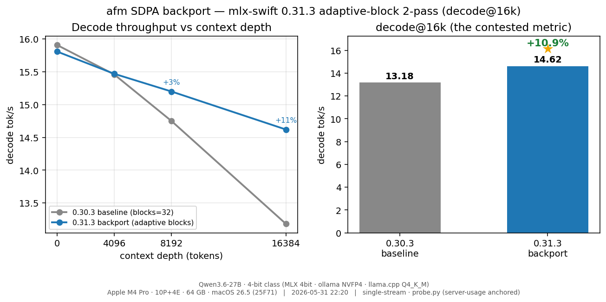

# afm SDPA Backport — Long-Context Decode (decode@16k)

**Date:** 2026-05-31 · **Machine:** Apple M4 Pro · 10P+4E · 64 GB · macOS 26.5
**Model:** `mlx-community/Qwen3.6-27B-4bit` (4-bit affine, group_size 64, `model_type qwen3_5`)
**Metric:** `probe_full.py` depth sweep — decode tok/s = server `usage.completion_tokens` ÷ decode window (tokenizer-immune).
**Branch / commit:** `afm-opt` @ `7d180f8`

## TL;DR

Backporting **mlx-swift 0.31.3's adaptive-block 2-pass SDPA** into afm's pinned 0.30.3 tree
makes long-context decode **+10.9% faster at 16k** (13.18 → 14.62 tok/s), **correct at every
depth**, while leaving shallow-context decode unchanged. This closes the long-context decode gap
to the newer-MLX engines (LM Studio et al.) — it is the same mechanism that made them faster.



## Result (matched, same warm chip, full `probe_full` depth sweep)

| context depth | 0.30.3 baseline (blocks=32) | 0.31.3 backport (adaptive) | Δ |
|--------------:|----------------------------:|---------------------------:|------:|
| 0             | 15.91 tok/s                 | 15.81 tok/s                | −0.6% |
| 4 096         | 15.46                       | 15.47                      | +0.1% |
| 8 192         | 14.75                       | 15.20                      | +3.1% |
| **16 384**    | **13.18**                   | **14.62**                  | **+10.9%** |

The gain **scales with context depth** — neutral when short, growing as the KV grows. That is
exactly the signature of adaptive split-K: at shallow depth the block count stays low (≈ the old
fixed 32), and it ramps up only when there is enough sequence to parallelize over.

Cross-checked against ad-hoc 3-run A/B (separate harness, same build): baseline 13.05–13.11
(median 13.08), backport 13.79–14.41 (median 14.38). Consistent with the pipeline's 13.18 / 14.62.

## Why it works

afm pins mlx-swift **0.30.3**, whose 2-pass vector SDPA hardcodes the split-K count
`constexpr int blocks = 32`. mlx-swift **0.31.3** turns `blocks` into a runtime *function-constant*
and **scales it with sequence length and device** (up to 1024). On the M4 Pro (`devc='d'`) with
GQA factor 6 (24 query / 4 KV heads), at N≈16k the dispatch selects **blocks = 512** — 16× the
parallelism of the hardcoded 32 — so the long-context decode attention saturates the GPU instead
of leaving split-K lanes idle. Pass-2 was rewritten to reduce `blocks/BN` partials in a loop
instead of the fixed 32-lane simd transpose.

## "0.31.3 = garbage at long context" was a metallib mismatch, not a kernel bug

Earlier sessions had concluded 0.31.x produced garbage past ~1500 tokens, which is why afm stayed
pinned to 0.30.3. That verdict was an artifact: `swift build` does **not** compile Metal — the
MLX kernels ship as a prebuilt `default.metallib`. Those tests ran a newer *dispatch* (which sets
function-constant 26 = `blocks`) against the *stale 0.30.3 metallib* whose kernel had no such
constant → undefined → garbage. Once the metallib is regenerated from the patched kernel
(`Scripts/rebuild-metallib.sh`), the adaptive kernel is **correct at ctx 31 / 4k / 16k** (verified:
coherent reasoning, correct "Paris" needle-in-haystack answer, no `!!!`/NaN).

## How it ships (patch system, survives clean/re-resolve)

- `Scripts/patches/mlx-cpp-sdpa/` — the three 0.31.3 SDPA source files (git-tracked).
- `Scripts/apply-mlx-sdpa-backport.sh` — `--check`/`--revert`-able; copies the 3 files + inserts the
  one helper the dispatch needs (`check_kernel_threadgroup_size`) into `utils.h`.
- `Scripts/rebuild-metallib.sh` — regenerates `default.metallib` from the patched kernel (Metal
  Toolchain required; Xcode 26 ships it as a separate downloadable component).
- `build.sh` — step 4a applies the C++/SDPA patches, step 4b rebuilds the metallib; both between
  `swift package resolve` and `swift build`.

## Reproduce

```bash
export AFM_BIN="$(pwd)/.build/release/afm"
export MACAFM_MLX_MODEL_CACHE=/Volumes/Crucial4TB/models/vesta-test-cache   # M4 Pro

# backport (committed default): apply -> rebuild metallib -> build -> profile
./Scripts/apply-mlx-sdpa-backport.sh && ./Scripts/rebuild-metallib.sh && swift build -c release
bash test-reports/qwen36-supremacy/scripts/run-afm-config.sh sdpa311

# baseline: revert -> rebuild -> build -> profile
./Scripts/apply-mlx-sdpa-backport.sh --revert && ./Scripts/rebuild-metallib.sh && swift build -c release
bash test-reports/qwen36-supremacy/scripts/run-afm-config.sh base303

# chart
BENCH_STAMP="$(date '+%Y-%m-%d %H:%M')" python3 test-reports/qwen36-supremacy/scripts/plot_sdpa_backport.py
```

Result files: `results/afm-base303-full.json`, `results/afm-sdpa311-full.json`,
`results/plots/sdpa_backport_depth.png`.
